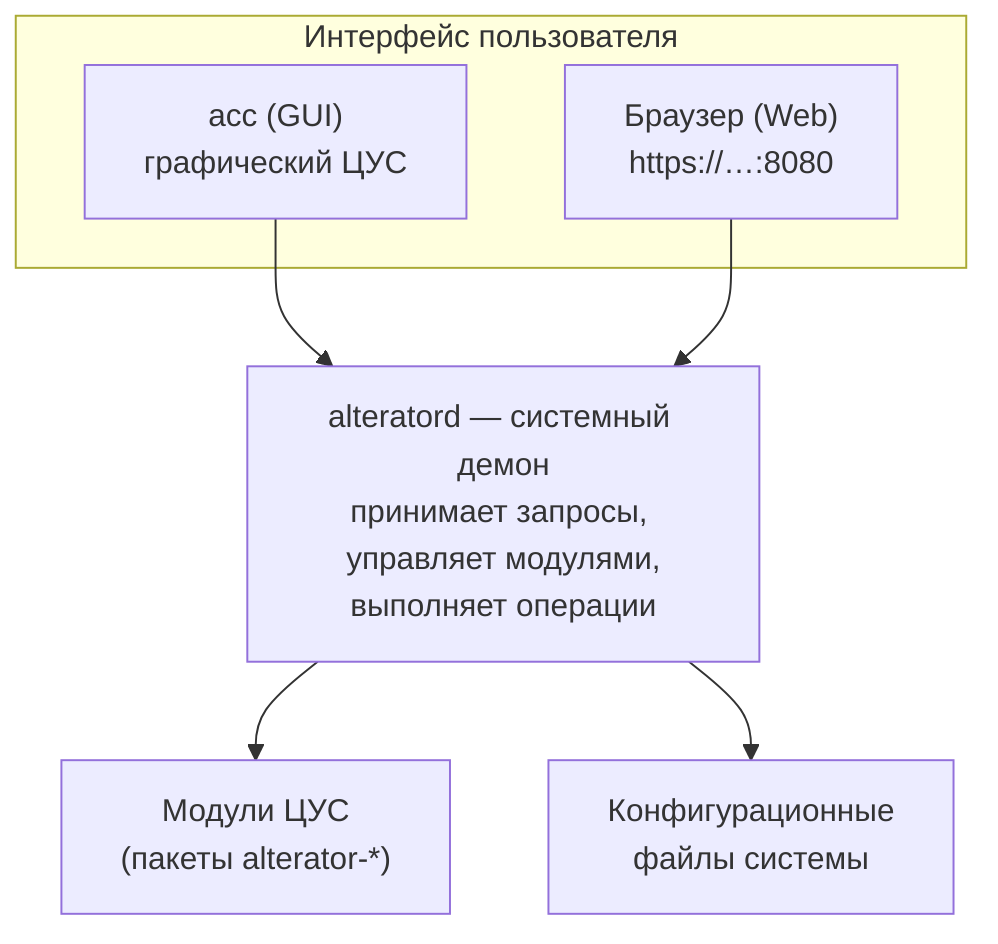

# Модуль 3 — Теория: ЦУС, Alterator и сетевая установка

## 1. Что такое Alterator и почему это важно

**Alterator** — уникальный для Альт Линукс фреймворк графического и веб-администрирования. Это не просто набор диалоговых окон — целая архитектурная система, которая принципиально отличает Альт от РедОС и «Астра Линукс».

В большинстве дистрибутивов администрирование сервера означает правку конфигурационных файлов в командной строке. В Альт для большинства типовых задач есть единый графический интерфейс — **ЦУС** (Центр управления системой), построенный на базе Alterator. При этом ЦУС не скрывает командную строку и не мешает ей — оба подхода сосуществуют и взаимодействуют.

Один из ключевых фактов из официальных материалов: ОС Альт имеет **более 100 модулей ЦУС**, покрывающих задачи от настройки сети до управления ролями и контролем целостности файлов.

## 2. Архитектура Alterator

Alterator построен по **клиент-серверной** архитектуре: административная логика отделена от интерфейса — интерфейс может быть графическим или веб-браузером, но под капотом работает один и тот же демон.



**alteratord** — центральный демон Alterator. Он:

- принимает запросы от интерфейсов (GUI и Web);
- управляет модулями;
- выполняет административные операции с правами, необходимыми для изменения системных конфигов;
- обеспечивает авторизацию через PAM.

**ahttpd** — HTTP-сервер для веб-интерфейса ЦУС. Обслуживает запросы браузера и передаёт их **alteratord**.

## 3. Два интерфейса ЦУС

### Графический интерфейс (GUI)

Доступен на рабочих станциях с установленной графической средой.

```bash
# Запуск из командной строки
acc

# Или через меню:
# Система → Администрирование → Центр управления системой
```

### Веб-интерфейс (Web UI)

Главное преимущество — доступ **удалённо через браузер**. Это делает ЦУС удобным для администрирования серверов без графической среды.

```bash
# Установить веб-интерфейс ЦУС
apt-get install alterator-fbi

# Запустить службу
systemctl start ahttpd
systemctl enable ahttpd

# Также должен быть запущен alteratord
systemctl start alteratord
systemctl enable alteratord

# Подключиться локально
https://127.0.0.1:8080

# Подключиться удалённо
https://<IP-адрес-сервера>:8080
```

При первом подключении браузер предупредит о самоподписанном сертификате — это нормально для внутренней инфраструктуры.

## 4. Модульная архитектура ЦУС

Каждая функция ЦУС реализована как **отдельный пакет-модуль**: устанавливаете только то, что нужно.

```bash
# Найти все доступные модули ЦУС
apt-cache search '^alterator'

# Посмотреть установленные компоненты
alteratorctl components list | grep alterator
```

Модули устанавливаются через `apt-get install` и автоматически появляются в интерфейсе ЦУС после перезапуска **alteratord**.

### Основные группы модулей

**Система:**

```bash
alterator-datetime        # Дата и время
alterator-users           # Управление пользователями
alterator-groups          # Управление группами
alterator-roles           # Модуль ролей (libnss-role)
alterator-control         # Управление подсистемой control
```

**Сеть:**

```bash
alterator-net-eth         # Ethernet-интерфейсы
alterator-net-wifi        # Wi-Fi
alterator-net-domain      # Имя домена
alterator-dhcp            # DHCP-сервер
alterator-net-openvpn     # OpenVPN
```

**Безопасность:**

```bash
alterator-net-iptables    # Межсетевой экран
alterator-osec            # Обнаружение различий между состояниями системы (Osec)
alterator-update-kernel   # Обновление ядра
```

**Обновления:**

```bash
alterator-updates         # Обновление системы
alterator-update-kernel   # Управление ядрами
```

**Сетевая установка:**

```bash
alterator-netinst         # Сервер сетевых установок
```

### Принцип установки модулей

```bash
# Пример: установить веб-ЦУС и модуль обновлений
apt-get install alterator-fbi alterator-updates

# Перезапустить службы, чтобы модуль появился в интерфейсе
systemctl restart alteratord ahttpd
# В Docker/учебном контейнере синхронный restart иногда долго не возвращает приглашение —
# тогда: systemctl --no-block restart alteratord ahttpd
```

После установки нового модуля обычно нужно перезапустить **alteratord** — иначе новый модуль может не появиться в интерфейсе. В среде практики (контейнер) удобнее **`systemctl --no-block restart …`**: команда сразу завершается, перезапуск идёт в фоне; через несколько секунд проверьте **`systemctl is-active alteratord ahttpd`**.

## 5. Что умеет ЦУС — практические задачи

### Настройка сетевого интерфейса

**Без ЦУС** (командная строка):

```bash
nano /etc/net/ifaces/eth0/options
nano /etc/net/ifaces/eth0/ipv4address
nano /etc/net/ifaces/eth0/ipv4route
ifup eth0
```

**С ЦУС:** модуль «Ethernet-интерфейсы» — IP, маска, шлюз, «Применить».

### Управление пользователями

```bash
# Без ЦУС
useradd -m -s /bin/bash ivan
passwd ivan
usermod -aG wheel ivan
```

**С ЦУС:** модуль «Пользователи» — создать учётную запись, пароль, группы.

### Настройка DHCP-сервера

**Без ЦУС:** правка `/etc/dhcp/dhcpd.conf` вручную. **С ЦУС:** модуль «DHCP-сервер» — диапазон адресов через форму.

## 6. Alterator и экосистема Альт

Модули напрямую связаны с особенностями ОС:

| Модуль | Связь с курсом / ОС |
|--------|---------------------|
| alterator-osec | Osec — обнаружение различий между состояниями системы (модуль 7) |
| alterator-roles | libnss-role, `/etc/role` (модуль 9) |
| alterator-control | утилита `control` (модуль 9) |
| alterator-net-eth | etcnet (модуль 5) |
| alterator-updates | обновления (модуль 2) |
| alterator-netinst | сервер сетевых установок (этот модуль) |

**Идея:** ЦУС — единая точка входа для многих механизмов Альт.

## 7. Сравнение с другими дистрибутивами

| Параметр | Альт Линукс | РедОС | Астра Линукс |
|----------|-------------|-------|--------------|
| Собственный фреймворк администрирования | Alterator / ЦУС | Нет | Нет |
| Веб-интерфейс управления | ahttpd, порт 8080 | Cockpit (опционально) | Нет единого стандартного |
| Количество GUI-модулей | 100+ | — | — |
| Управление через GUI | большинство типовых задач | ограниченно | ограниченно |
| Сетевая установка через GUI | alterator-netinst | нет штатного аналога | нет штатного аналога |

В РедОС и «Астра» администратор часто опирается на командную строку. В Альт для многих типовых задач есть графический или веб-интерфейс как часть экосистемы, а не только «опциональное дополнение».

## 8. Сетевая установка ОС — что это и зачем

Сетевая установка позволяет поставить ОС Альт **без физического носителя** (USB/DVD): машина загружается по сети, получает образ с сервера и устанавливает систему.

Удобно, когда нужно:

- развернуть ОС на многих компьютерах одновременно;
- установить ОС на машину без DVD и USB;
- провести установку удалённо (другой офис, серверная);
- стандартизировать развёртывание.

## 9. Как работает сетевая установка — протоколы и этапы

Используются **DHCP**, **TFTP**, **PXE**. Это не «просто dnsmasq», а согласованная работа служб в инфраструктуре, которую ЦУС настраивает через единый интерфейс.

**Цепочка загрузки:**

1. Клиент включается и отправляет **DHCP-запрос** (PXE в прошивке сетевой карты).
2. **DHCP-сервер** отвечает: IP и сетевые параметры, **filename** (например `pxelinux.0`), **next-server** — адрес TFTP.
3. Клиент скачивает PXE-загрузчик с **TFTP**.
4. PXE-загрузчик подгружает **ядро** (`vmlinuz`) и **initramfs**.
5. Ядро снова запрашивает IP по DHCP (часто тот же адрес).
6. Инсталлятор получает пакеты **по сети с сервера репозитория** или **с ISO**, размещённого на сервере сетевых установок.
7. Дальше — обычная установка системы.

**Важно:** DHCP, TFTP и источник установочных пакетов **не обязаны** быть на одной машине — роли можно разнести.

## 10. Настройка сервера сетевых установок через ЦУС

Инфраструктура настраивается через ЦУС, модуль **alterator-netinst** — в отличие от сценариев, где каждую службу собирают вручную по отдельности.

**Шаг 1 — пакеты и службы**

```bash
apt-get update
apt-get install alterator-fbi alterator-netinst alterator-net-domain
systemctl --no-block restart alteratord ahttpd   # в контейнере надёжнее, чем обычный restart
systemctl enable alteratord ahttpd
```

**Шаг 2 — имя сервера**  
ЦУС → при необходимости модули сети/домена, либо:

```bash
hostnamectl set-hostname netinstall.company.local
# В учебном контейнере при «Device or resource busy»: echo netinstall.company.local | sudo tee /etc/hostname && sudo hostname netinstall.company.local
```

**Шаг 3 — сетевой интерфейс**  
Интерфейс для сервиса сетевой установки лучше вести через **etcnet**, не через NetworkManager. Для DHCP-сервера на интерфейсе нужен **статический IP**. ЦУС → «Ethernet-интерфейсы» → статический адрес.

**Шаг 4 — домен**  
Перед настройкой DHCP задайте имя домена: ЦУС → «Домен» → тип DNS → имя (например `company.local`).

**Шаг 5 — DHCP**  
ЦУС → «DHCP-сервер» → включить → диапазон адресов **в той же подсети**, что и статический IP интерфейса.

**Шаг 6 — образ установщика**  
ЦУС → «Сетевая установка» → добавить образ: с ISO на диске или с CD/DVD.

**Шаг 7 — вариант загрузки для клиента**  
В модуле «Сетевая установка» можно выбрать, что предложить при PXE:

- установка системы (полный инсталлятор);
- загрузка Live без установки;
- тест памяти (memtest).

## 11. Удалённое управление установкой через VNC

В сетевой установке Альт можно **наблюдать и управлять** процессом по **VNC**.

**Клиентский режим** — администратор подключается к устанавливаемой машине (пароль задаётся в модуле сетевой установки в ЦУС):

```bash
vncviewer <IP-адрес-клиента>
# vncviewer обычно в пакете tigervnc
```

**Серверный режим** — клиент установки подключается к **прослушивающему** VNC у администратора:

```bash
vncviewer -listen
# В модуле ЦУС указать IP рабочей станции администратора
```

Удобно для машин в другом офисе или серверной без физического доступа к консоли.

## 12. Что проверить после настройки

```bash
systemctl status alteratord
systemctl status ahttpd

curl -k https://127.0.0.1:8080

alteratorctl components list | grep alterator

systemctl status dhcpd   # если настроен DHCP

journalctl -u alteratord --since today
```

## 13. Итог для администратора Альт

ЦУС и Alterator — это не «обёртка» над shell, а **административная инфраструктура**, которая:

- снижает порог вхождения;
- стандартизирует типовые задачи;
- связывает etcnet, control, libnss-role, Osec и др. с **единым интерфейсом**;
- даёт **удалённое** управление сервером через браузер;
- поддерживает **сетевую установку** через единый GUI-мастер.

Три команды, полезные запомнить:

```bash
acc                                    # графический ЦУС
systemctl start alteratord ahttpd      # затем https://127.0.0.1:8080 — веб-ЦУС
apt-cache search '^alterator' | grep <ключевое_слово>   # поиск модулей
```
