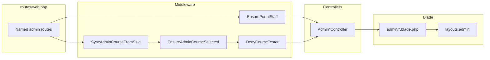

# Админка Laravel (курс): обзор и порядок работ

Документ фиксирует текущую структуру приложения в `laravel-course-files` и универсальный порядок изменений, чтобы снизить регрессии (маршруты, layout, деплой).

---

## 1. Уточнение цели следующего этапа (для заказчика)

Перед крупными изменениями зафиксируйте один из вариантов (или комбинацию):

- **Рефакторинг ассетов** — единый способ подключения JS/CSS, вынесение inline-скриптов из Blade.
- **Новая страница / раздел** — конкретный URL, роли (`PortalStaff`), нужен ли slug курса в пути.
- **Смена layout** — перевод экранов с `layouts.course` на `layouts.admin` или наоборот.
- **Другое** — отчёты, интеграции, копирайт.

**До ответа заказчика** разумный дефолт по приоритету: **стабильность** (без 500 из Blade), **согласованность `route('admin.*')` с параметром курса**, **актуальный деплой** через `scripts/deploy-laravel-stand.sh`.

---

## 2. Текущее состояние (обзор)

### Каталог шаблонов

- Основной каталог: `resources/views/admin/` (включая подкаталог `partials/`, порядка **30** blade-файлов; точное число может расти).

### Шаблонизатор

- Laravel Blade: `@extends`, `@section`, `{{ }}`, `route()`, `@include`.

### CSS и JS

- Базовый layout админки `resources/views/layouts/admin.blade.php` в `<head>` подключает шрифты (Manrope), `asset('css/course.css')`, `asset('css/admin-panel.css')`.
- Глобальных `<script>` в `layouts/admin` нет; скрипты подключаются точечно в страницах (CDN, `public/js`, inline в крупных blade).
- Страницы с `@extends('layouts.course')` наследуют стили/скрипты курса; для админских маршрутов на них действуют те же `View::composer`, что и для `admin.*` (см. ниже).

### Исключение по layout

- `admin/course-module-content-edit.blade.php` расширяет **`layouts.course`**, а не `layouts.admin` — другая оболочка и набор стилей; при правках проверяйте composers и переменные (`$ap`, `portalStaffAccess`).

### View composers (`routes/web.php`)

- Общий composer для `layouts.course`, `admin.*`, `portal.*`, `layouts.admin`, `teacher-course-report` — **`portalStaffAccess`**.
- `layouts.admin` — крошки, сайдбар, вкладки курса (`AdminNavigation`).
- `layouts.course` — для маршрутов `admin.*` дополнительно **`adminBreadcrumbs`**.
- `admin.*` и `teacher-course-report` — **`$ap`** = `AdminNavigation::adminCourseRouteParams()` для генерации ссылок с `adminCourse`.

### Маршруты

- Группы с `EnsureLearner`, `EnsurePortalStaff`; префикс курса **`adm/kurs/{adminCourse:slug}/...`**; глобальные `/adm/...` без slug (панель, курсы, сотрудники, Docker-библиотека и т.д.).
- Есть **legacy-редиректы** со старых путей на именованные маршруты с `adminCourse` (см. `web.php`).

### Деплой

- Скрипт `draft-os-alt-course/scripts/deploy-laravel-stand.sh` синхронизует каталог `resources/views/admin/` целиком. Новые публичные файлы или нестандартные пути добавляйте в скрипт явно, если rsync по каталогу их не покрывает.

---

## 3. Экраны админки (GET и основные UI)

| Область | Имена маршрутов (основные) | Blade |
| --- | --- | --- |
| Панель | `admin.panel` | `admin/panel.blade.php` |
| События | `admin.activity` | `admin/activity.blade.php` |
| Docker-библиотека | `admin.docker.library` | `admin/docker-library.blade.php` |
| Сотрудники | `admin.staff.index`, `admin.staff.create`, `admin.staff.edit` | `staff-index`, `staff-edit` |
| Каталог курсов | `admin.courses.index`, `admin.courses.create`, `admin.courses.edit` | `courses-index`, `course-edit` |
| Обучающиеся портала | `admin.learners.portal`, `admin.learners.people.detail` | `learners-portal`, `learners-people` |
| Курс (`{adminCourse}`) | | |
| Настройки / модули | `admin.course.settings`, `admin.course.modules` | `course-settings`, `course-modules-index` |
| Разделы модуля | `admin.course.module.sections` | `course-module-sections` |
| Практика модуля | `admin.course.module.practice` | `course-module-practice` |
| Настройки раздела | `admin.course.module.section.settings` | `course-section-settings` |
| Контент модуля (БД) | `admin.course.module.content.edit` | `course-module-content-edit` |
| Содержимое (теория) | `admin.theory.index`, `admin.theory.zip` | `theory-index` |
| Редактор теории | `admin.theory.edit` | `theory-edit` |
| Превью | `admin.theory.preview-*` | `theory-preview`, `content-*` |
| Тесты | `admin.quiz.index`, `admin.quiz.edit.module`, `admin.quiz.edit.final` | `quiz-index`, `quiz-edit`, `quiz-edit-db` |
| Образы практики | `admin.practice.images.*` | `practice-images-index`, `practice-image-edit` |
| Обучающиеся курса | `admin.learners.course`, `admin.learners.course.detail`, `admin.learners.course.learner.*` | `learners-course` |
| Сертификаты | `admin.certificates`, `admin.certificates.show` | `certificates`, `certificate-preview` |

Контроллеры: `AdminPanelController`, `AdminStaffController`, `AdminCoursesController`, `AdminCourseSettingsController`, `AdminCourseContentController`, `AdminTheoryController`, `AdminQuizController`, `AdminPracticeImagesController`, `AdminDockerLibraryController`, `AdminLearnersController` в `app/Http/Controllers/`.

*(На части глобальных `/adm/...` цепочка middleware короче — сверяйте объявление группы в `web.php`.)*

---

## 4. Чеклист: маршрут и контроллер

При добавлении или изменении экрана:

1. Зарегистрировать маршрут с **именем** `admin.*`; для URL под курсом — параметр **`adminCourse`** (префикс `adm/kurs/{slug}`).
2. В контроллере проверить гейты: **`PortalStaffAccess`**, при необходимости **`DenyCourseTester`** (чувствительные GET под курсом).
3. Редиректы и ссылки: **`Controller::adminCourseRouteParams()`** / **`AdminNavigation::adminCourseRouteParams()`** / **`$ap`**, чтобы не ловить **`UrlGenerationException`**.
4. Убедиться, что middleware группы совпадают с чувствительностью данных (staff-only, выбранный курс).

---

## 5. Чеклист: Blade, layout, CSS/JS, деплой

1. По умолчанию новый экран: **`@extends('layouts.admin')`**; `resources/views/admin/<имя>.blade.php` или `admin/partials/...`.
2. Если нужен вид «как у обучающегося» — осознанно **`layouts.course`**; проверить **`portalStaffAccess`**, **`$ap`**, крошки.
3. Общие стили панели — **`public/css/admin-panel.css`**; курс — **`public/css/course.css`**; точечные inline только при отсутствии переиспользования.
4. Скрипты: по возможности один способ (CDN vs `public/js`) — проще CSP и кэш.
5. Регрессия: поиск по проекту **`route('admin.`** без `adminCourse` / без **`$ap`** там, где маршрут их требует.
6. После изменений: **`bash scripts/deploy-laravel-stand.sh`**; при новых путях файлов — **дополнить скрипт** rsync-целями.
7. На стенде при подозрении на старый compiled Blade: **`php artisan view:clear`** (скрипт деплоя обычно вызывает очистку кэша).

### Риски (кратко)

| Риск | Как снизить |
| --- | --- |
| `UrlGenerationException` | Всегда передавать **`$ap`** / `array_merge($ap ?? [], …)` для маршрутов с `adminCourse`. |
| Разный layout | Явно выбрать `admin` или `course`; для `course` проверить composers. |
| `DenyCourseTester` | Новые чувствительные GET под курсом — в той же группе, что и остальная админка курса. |
| Legacy URL | Проверить редиректы в `web.php` и закладки. |
| Inline JS в Blade | URL выносить в `data-*` или отдельный endpoint. |
| Blade **`@php($x = …)`** сразу перед HTML или другой `@`-директивой | В ряде версий Laravel даёт **незакрытый `<?php(`** и **ParseError**; использовать блок **`@php` … `@endphp`** с обычными операторами и `;`. |
| Текст с `@` в HTML | Для литерала `@@` в исходнике Blade, чтобы в выводе было `@`. |
| Деплой не подхватывает файл | Расширить **`deploy-laravel-stand.sh`**. |

---

## 6. Порядок работ (универсальный шаблон)

1. Маршрут и имя (`admin.*`), нужен ли **`adminCourse`**.
2. Контроллер: авторизация, редиректы с параметрами курса.
3. Blade: layout по умолчанию `layouts.admin`.
4. Стили: сначала `admin-panel.css`.
5. Скрипты: единообразное подключение.
6. Регрессия маршрутов и деплой.

После фиксации цели с заказчиком (раздел 1) шаги 1–3 наполняются конкретными файлами и критериями приёмки.
